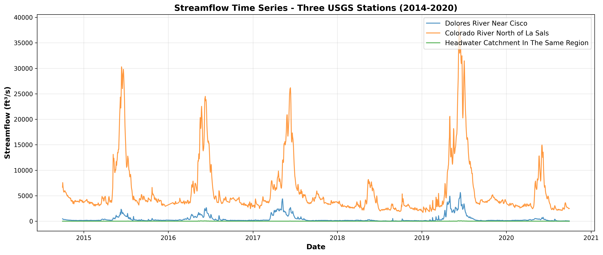

Streamflow monitoring in semi-arid Utah is critical because runoff is highly variable and largely driven by snowmelt from headwater catchments in the Wasatch and Uinta Mountains. Long-term USGS discharge records help detect shifts in runoff timing, drought severity, and climate-driven hydrologic changes, which directly inform reservoir management, irrigation, municipal supply, and environmental flow planning.
Using USGS streamflow data from three eastern Utah sites (Dolores River, Colorado River north of the La Sals, and a nearby headwater stream), this study analyzed daily, weekly, and monthly discharge patterns. Missing data were interpolated, wet and dry years were identified by annual volume, and multi-resolution comparisons were conducted using Python (Pandas, NumPy, Matplotlib).

Results show strong similarity in timing across sites but major differences in magnitude, largely controlled by drainage area. Larger basins (Colorado River) produced higher flows, while the small headwater basin had much lower discharge but flashier responses. Temporal aggregation smoothed variability at longer timescales. Reservoir regulation on the Dolores River attenuated peak flows and increased baseflow stability, especially compared to the unregulated headwater stream, which showed sharper, earlier snowmelt peaks and greater variability. To conclude, basin size and regulation strongly influence streamflow magnitude and variability, and these insights support reservoir operations, flood forecasting, seasonal planning, and drought management.
The HI1 repository contains all of the code to reproduce the time series analysis done for this report. 
